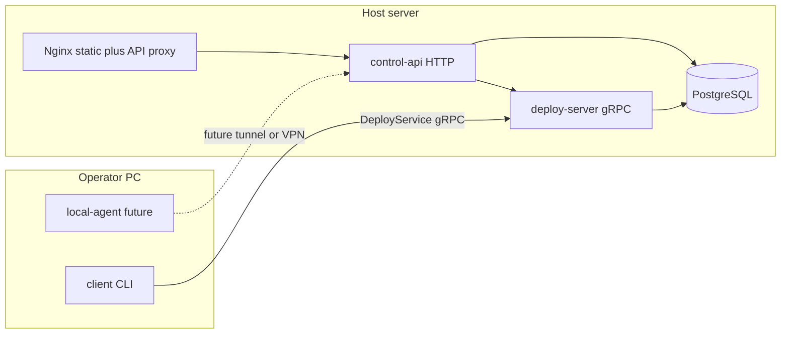

# Архитектура: серверный стек vs локальный ПК

Этот документ фиксирует **роли каталогов** в монорепозитории: что относится к установке на хост с nginx/PostgreSQL, что — к рабочей станции оператора, и что **общее** (контракт gRPC).

## Диаграмма потоков

## Матрица каталогов

| Каталог | Сервер | Локальный ПК | Примечание |
|---------|--------|----------------|------------|
| [`proto/`](../proto/) | да | да | Единый контракт `DeployService` (gRPC). **Общий минимум** между продуктами. |
| [`server-stack/server/`](../server-stack/server/) | да | нет | Бинарь `deploy-server`. |
| [`server-stack/control-api/`](../server-stack/control-api/) | да | нет | HTTP JSON для дашборда. |
| [`server-stack/deploy-control/`](../server-stack/deploy-control/) | да | нет | Агрегация gRPC + ФС + БД + nginx. |
| [`server-stack/deploy-db/`](../server-stack/deploy-db/) | да | нет | Миграции выполняет `deploy-server`. |
| [`server-stack/deploy-core/`](../server-stack/deploy-core/) | да | опционально | Общая логика релизов; локальный CLI её не использует. |
| [`server-stack/deploy/`](../server-stack/deploy/) | да | нет | Docker entrypoint, nginx examples, systemd/ubuntu. |
| [`local-stack/client/`](../local-stack/client/) | нет | да | CLI: упаковка артефакта и gRPC. |
| [`local-stack/local-agent/`](../local-stack/local-agent/) | нет | да | Заглушка; см. [`LOCAL_STACK_DESIGN.md`](LOCAL_STACK_DESIGN.md). |
| [`local-stack/desktop-ui/`](../local-stack/desktop-ui/) + [`local-stack/desktop-client/`](../local-stack/desktop-client/) | нет | да | Tauri-приложение `pirate-client` + SPA + crate `pirate-desktop`; см. [`DESKTOP_CLIENT.md`](DESKTOP_CLIENT.md). |
| [`server-stack/frontend/`](../server-stack/frontend/) | да (серверный UI) | отдельно при необходимости | Vite-дашборд; ходит в `control-api` на сервере. |
| [`Dockerfile`](../Dockerfile), [`docker-compose.test.yml`](../docker-compose.test.yml) | да | нет | Сборка и e2e серверного стека. |

## Установка «пакетов»

- **Серверный пакет (хост):** PostgreSQL (опционально), `deploy-server`, `control-api`, nginx, статика из `server-stack/frontend/dist/` (см. [`PHASE6.md`](PHASE6.md), [`DOCKER_E2E.md`](DOCKER_E2E.md)).
- **Локальный пакет (ПК):** бинарь `client` из `local-stack/client`, в перспективе — `local-agent` и отдельный UI; не требует полного стека на той же машине.

## Общий контракт `proto` (shared crate)

- Crate **`deploy-proto`** остаётся в корне репозитория [`proto/`](../proto/) и подключается и серверными, и локальными крейтами через `path = "../../proto"` / `../proto` в зависимости от глубины.
- **Два репозитория в будущем:** вынести `proto` в отдельный crate (crates.io или git submodule), чтобы серверный и локальный репозитории зависели от одной версии контракта без дублирования.

## См. также

- [`LOCAL_GATEWAY.md`](LOCAL_GATEWAY.md) — туннели, TLS, не смешивать gateway с CLI деплоя.
- [`LOCAL_STACK_DESIGN.md`](LOCAL_STACK_DESIGN.md) — проекты, локальный UI, `local-agent`.
